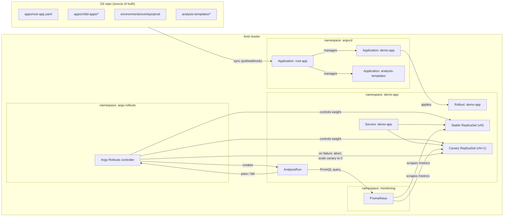

# gitops-argocd-demo

**Progressive delivery on Kubernetes with an automatic, SLO-gated rollback — no human in the loop.**

This repo is a self-contained GitOps reference implementation: Argo CD manages the cluster via an App-of-Apps pattern, Argo Rollouts drives a canary release, and Prometheus `AnalysisTemplates` gate each canary step against a success-rate and latency SLO. Ship a regression and the rollout aborts and rolls itself back before it ever reaches full traffic — the same guarantee a well-run SRE org gives its customers, reproduced on a laptop with `kind`.

It exists to show working judgment, not just working YAML: every non-obvious choice below is written down with the alternative I didn't take and why, and the write-up is honest about what's demo-scope versus what a real production system would need on top (see [Production Hardening](#production-hardening)).

> Looking for the walkthrough script instead of the design rationale? See [`DEMO.md`](./DEMO.md).

## Table of Contents

- [What This Demonstrates](#what-this-demonstrates)
- [Architecture](#architecture)
- [Repo Structure](#repo-structure)
- [Quickstart](#quickstart)
- [Decision Log](#decision-log)
- [Failure-Mode Walkthrough](#failure-mode-walkthrough)
- [Production Hardening](#production-hardening)

## What This Demonstrates

- **App-of-Apps GitOps** — one root `Application` fans out to every managed app; the cluster's desired state is fully described by this git repo, and Argo CD's `selfHeal` continuously reconciles drift back to it.
- **Progressive delivery** — Argo Rollouts replaces the `Deployment` for the demo service with a `Rollout` that shifts traffic in weighted steps (20% → 40% → 100%) instead of an all-at-once rolling update.
- **Automated, metric-gated promotion** — each canary step is followed by an `AnalysisRun` that queries Prometheus directly; a step only promotes if live success-rate and p99 latency clear their thresholds.
- **Automatic rollback on SLO breach** — a failing `AnalysisRun` aborts the `Rollout` and scales the canary `ReplicaSet` back to zero automatically. [`scripts/inject-failure.sh`](./scripts/inject-failure.sh) reproduces this on demand.
- **GitOps self-heal as a safety net** — because everything here is declared in git, an out-of-band `kubectl patch` (like the failure-injection script uses) gets flagged `OutOfSync` and can be reverted by Argo CD itself, not just by rollback logic.

## Architecture



**The loop that matters:** `RC → AR → Prom → AR → RC`. The Rollouts controller doesn't just watch pod readiness — it delegates the promote/abort decision to live Prometheus data on every step, via the `AnalysisRun`. That's the difference between a rolling update and progressive delivery.

Argo Rollouts and the Prometheus stack are installed **imperatively** during bootstrap, not as Argo CD `Applications` — see [Decision Log](#decision-log) entry 4 for why, and [Production Hardening](#production-hardening) for how that changes in a real environment.

## Repo Structure

```
gitops-argocd-demo/
├── README.md                    # this file
├── DEMO.md                      # 3-minute narrated demo script
├── bootstrap/                   # one-time, imperative cluster bring-up (you run these)
│   ├── kind-cluster.yaml
│   ├── 00-namespaces.yaml
│   ├── 01-install-argocd.sh
│   ├── 02-install-argo-rollouts.sh
│   ├── 03-install-prometheus-stack.sh
│   └── 04-bootstrap-root-app.sh
├── apps/                        # App-of-Apps: Argo CD Application manifests only
│   ├── root-app.yaml
│   └── child-apps/
│       ├── demo-app.yaml
│       └── analysis-templates.yaml
├── environments/
│   ├── base/demo-app/           # Rollout, Service, ConfigMap (kustomize base)
│   └── overlays/{dev,prod}/     # per-env replica counts
├── analysis-templates/          # cluster-scoped SLO gates, reused by the Rollout
│   ├── success-rate.yaml
│   └── latency-p99.yaml
├── demo-app/                    # the canaried service: Go, /metrics, /healthz
│   ├── main.go
│   ├── go.mod
│   └── Dockerfile
└── scripts/                     # demo helpers (you run these)
    ├── inject-failure.sh
    ├── watch-rollout.sh
    └── teardown.sh
```

## Quickstart

Prerequisites: `docker`, `kind`, `kubectl`, `helm`, and the [Argo Rollouts kubectl plugin](https://argo-rollouts.readthedocs.io/en/stable/installation/#kubectl-plugin-installation).

```bash
# 1. Cluster
kind create cluster --config bootstrap/kind-cluster.yaml
kubectl apply -f bootstrap/00-namespaces.yaml

# 2. Platform: Argo CD, Argo Rollouts, Prometheus
./bootstrap/01-install-argocd.sh
./bootstrap/02-install-argo-rollouts.sh
./bootstrap/03-install-prometheus-stack.sh

# 3. Build the demo service and load it into kind (no registry needed locally)
docker build -t demo-app:latest demo-app/
kind load docker-image demo-app:latest --name gitops-demo

# 4. Point Argo CD at this repo
export REPO_URL=https://github.com/Chiagoziemo/gitops-argocd-demo.git
./bootstrap/04-bootstrap-root-app.sh

# 5. Watch it sync, then watch the rollout
kubectl -n argocd get applications -w
kubectl argo rollouts get rollout demo-app -n demo-app --watch
```

Then trigger the failure-mode demo:

```bash
./scripts/inject-failure.sh 0.4   # deploy a version with a 40% error rate
```

## Decision Log

Each entry: the decision, what else I considered, and the trade-off I accepted.

| # | Decision | Alternatives considered | Why this, and what it costs |
|---|---|---|---|
| 1 | **Argo CD** for GitOps | Flux | Argo CD's App-of-Apps pattern and UI make the sync/health/drift model directly visible to a reviewer without reading logs — important when the audience is evaluating the work, not just running it. Flux's Kustomize controller + `HelmRelease` composition is arguably more Unix-y, but has a steeper "what's actually happening" curve to demo live. |
| 2 | **kind** for the cluster | minikube, k3d | Multi-node by default, trivially scriptable, and the same tool a CI pipeline would use for ephemeral integration-test clusters — keeps this repo one step from being wired into GitHub Actions later. |
| 3 | **App-of-Apps**, not `ApplicationSet` | `ApplicationSet` with a list/cluster generator | With exactly two child apps and one cluster, an `ApplicationSet` generator adds a layer of indirection with no payoff. App-of-Apps is the simpler mental model here. Flagged in [Production Hardening](#production-hardening) as the first thing to swap in for real multi-env/multi-cluster fan-out. |
| 4 | **Argo Rollouts and Prometheus installed imperatively** in `bootstrap/`, not as Argo CD `Applications` | Manage them as GitOps-synced Applications from the start | Breaks a chicken-and-egg problem (Argo CD can't validate `Rollout`/`AnalysisTemplate` CRs before the Rollouts CRDs exist) and keeps the demo's App-of-Apps tree focused on the workload being showcased, not cluster plumbing. Cost: these two components aren't drift-corrected by Argo CD — a real environment should manage them as GitOps `Applications` too, in a separate platform `AppProject` with sync-wave ordering. |
| 5 | **Basic (weighted-ReplicaSet) canary**, no service mesh or ingress controller | Istio/Linkerd traffic splitting, NGINX ingress canary annotations | Zero extra infrastructure dependency — works against a bare `ClusterIP` Service on stock `kind`. Keeps the moving parts limited to what's actually being demonstrated (rollout mechanics + SLO gating), not mesh operations. Cost: weight precision is quantized by replica count (`replicas: 5` → 20% steps), and there's no header/cookie-based routing for internal dogfooding before public traffic — both real limitations of this strategy, not just demo simplifications. |
| 6 | **Deliberately tight SLO thresholds** in `analysis-templates/` (95% success rate, 250ms p99) | Threshold derived from a real error budget | Needs to fail fast and visibly for a 3-minute demo. These numbers are picked so `inject-failure.sh` reliably trips the gate within one or two analysis intervals — not derived from any historical SLI. Called out explicitly so it doesn't read as "this is how you set a real SLO." |
| 7 | **Purpose-built Go service** for the canary target | Reuse `argoproj/rollouts-demo` image | Wanted metric names (`http_requests_total`, `http_request_duration_seconds_bucket`) and the failure-injection knob to be first-party and match this repo's own `AnalysisTemplates`, rather than reverse-engineering someone else's image. |
| 8 | **Distroless** base image for the demo service | `alpine`, `scratch` | Smaller attack surface, no shell, forces the build to produce a static binary — cheap to do, signals the same discipline a real image pipeline should have. |
| 9 | **`failureLimit: 3` over 5 checks at a 15s interval** | Fail on the first bad measurement | A single Prometheus scrape can be noisy (a GC pause, a cold connection pool). Tolerating 2 bad measurements before aborting avoids false-positive rollbacks on transient blips while still failing within ~45-60s of a real regression. |

## Failure-Mode Walkthrough

### 1. Happy path — a clean release

A new revision (no change to `FAILURE_RATE`) rolls out: 20% → `AnalysisRun` passes → 40% → `AnalysisRun` passes → 100%. Both stable and canary `ReplicaSets` stay healthy throughout; the old `ReplicaSet` scales to zero once the new one reaches full weight.

### 2. SLO breach — the main event

Run `scripts/inject-failure.sh 0.4`. Sequence:

1. The patch changes the `Rollout`'s pod template (new `FAILURE_RATE`/`VERSION` env vars), producing a new `ReplicaSet` revision.
2. Argo Rollouts starts the canary at `setWeight: 20`, pauses 30s, then launches an `AnalysisRun` against `success-rate` and `latency-p99`.
3. With ~40% of requests failing (and those failures also sleeping 400ms, well past the 250ms p99 gate), both metrics start missing their `successCondition` almost immediately.
4. After 3 failed measurements (well inside the ~75s the two templates need at `interval: 15s`), the `AnalysisRun` phase flips to `Failed`.
5. Argo Rollouts marks the `Rollout` `Degraded`, aborts the promotion, and scales the canary `ReplicaSet` back to 0. The stable `ReplicaSet` never stopped serving 100% of *un-canaried* traffic — worst case, ~20-40% of traffic saw the elevated error rate for under a minute, not all of it, indefinitely.
6. No one ran `kubectl rollout undo`. The SLO gate did.

### 3. GitOps drift vs. auto-rollback — two safety nets, not one

`inject-failure.sh` patches the live `Rollout` directly, which is *also* a drift event from Argo CD's perspective: the live spec no longer matches `environments/overlays/prod` in git. With `selfHeal: true` (set in every `Application` in this repo), Argo CD will revert that patch back to git's `FAILURE_RATE: "0.0"` on its next reconcile — independently of, and possibly before, the `AnalysisRun` even finishes. Watch `kubectl -n argocd get application demo-app` during the failure demo and you'll see it go `OutOfSync` and then back to `Synced`. This is worth narrating explicitly: **it's two independent control loops that both happen to protect you here** — Rollouts' SLO gate protects you from a bad revision reaching full traffic, and Argo CD's self-heal protects you from anyone (including this demo script) bypassing git entirely.

### 4. The metrics pipeline itself fails mid-canary

If Prometheus is unreachable when an `AnalysisRun` tries to query it, that measurement comes back `Error`, not `Failed` — but Argo Rollouts counts `Error` measurements against `failureLimit` the same as `Failed` ones by default. Practically: if your SLO gate loses its eyes mid-rollout, the rollout fails closed (aborts) rather than promoting blind. That fail-safe default is worth calling out — a naive implementation might treat "couldn't check" as "assume it's fine," which is exactly backwards for a promotion gate.

### 5. Argo CD control plane goes down

Argo Rollouts is a separate controller from Argo CD and keeps running independently — an in-flight canary continues its steps and analysis even if `argocd-server`/`argocd-application-controller` are down. What stops is *new* syncs: git changes stop reaching the cluster until Argo CD recovers. Blast radius is bounded because Argo CD sits in the control plane, not the data path — the demo app keeps serving traffic the whole time.

### 6. A node dies mid-rollout

Pods on the failed node are marked `NotReady` and rescheduled by the Kubernetes scheduler; the `Service` stops routing to them once readiness probes fail, so no traffic is lost to dead endpoints — but this repo has no `PodDisruptionBudget`, so nothing stops a *voluntary* disruption (a node drain during a cluster upgrade, say) from taking out every pod in one `ReplicaSet` at once. Flagged in [Production Hardening](#production-hardening).

## Production Hardening

What's in this repo is scoped to demonstrate the progressive-delivery and SLO-rollback mechanism clearly in under five minutes of setup. Running this pattern for a real service would additionally need:

**Delivery & supply chain**
- Cluster add-ons (Argo Rollouts, Prometheus) managed as Argo CD `Applications` in a dedicated platform `AppProject`, not installed imperatively — see Decision Log #4.
- Pinned image digests, not the mutable `demo-app:latest` tag used here; images signed with `cosign` and verified at admission (Kyverno/OPA Gatekeeper) before they can run.
- CI on every PR: `kustomize build` + `kubeconform`/`kubeval` + policy checks (`conftest`), and the actual image build/push — none of which exists in this repo today.
- Promotion between environments via PR + reviewed diff (or Argo CD Image Updater for automated tag bumps), not hand-editing `environments/overlays/prod`.

**Delivery topology**
- `ApplicationSet` with a cluster or git-directory generator once there's more than one environment/cluster to fan out to (see Decision Log #3).
- A traffic-management plugin (Istio/Linkerd, or an ingress controller's native canary support) instead of weighted-`ReplicaSet` canary, for precise (non-replica-quantized) weights and header/cookie-based internal dogfooding before public exposure.

**SLOs & observability**
- Thresholds in `analysis-templates/` derived from actual historical SLIs and an agreed error-budget policy, not the fast-fail demo values used here (Decision Log #6).
- Prometheus with real retention/HA — this repo's install uses `retention: 6h` and a single replica; production needs remote-write to Thanos/Mimir/Cortex and multi-replica Prometheus.
- Argo CD / Argo Rollouts notifications wired to Slack/PagerDuty on `Degraded`/`Aborted`, so a human is paged on every auto-rollback even though no human had to act to trigger it.
- Canary analysis extended to business metrics (checkout success, signup completion), not just infra-level success-rate/latency — an SLO breach isn't the only thing worth aborting a release for.

**Security & multi-tenancy**
- Argo CD behind SSO/OIDC, not the bootstrap `argocd-initial-admin-secret` password used here; per-team `AppProject`s scoping `sourceRepos`/`destinations`/`clusterResourceWhitelist` instead of the `default` project used throughout this repo.
- Secrets via External Secrets Operator or Sealed Secrets — nothing sensitive lives in this repo's `ConfigMap`s today, but there's also no mechanism stopping it from happening by accident.
- Default-deny `NetworkPolicy` between namespaces; today every namespace here can reach every other.

**Reliability**
- `PodDisruptionBudget`s and topology spread constraints on the `Rollout`, so a voluntary disruption (node drain, cluster upgrade) can't take an entire `ReplicaSet` down at once (Failure-Mode #6).
- `ResourceQuota`/`LimitRange` per namespace and a `HorizontalPodAutoscaler` on the `Rollout` — this repo hardcodes `replicas: 5`.

---

Questions, or want to see it run end-to-end? See [`DEMO.md`](./DEMO.md) for a 3-minute narrated walkthrough.
